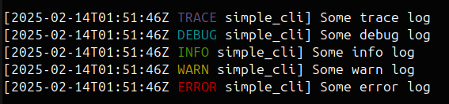

[](https://github.com/smessmer/clap-logflag/actions/workflows/ci.yml)
[](https://crates.io/crates/clap-logflag)
[](https://docs.rs/clap-logflag)
[](https://github.com/smessmer/clap-logflag/blob/master/LICENSE-MIT)
[](https://github.com/smessmer/clap-logflag/blob/master/LICENSE-APACHE)
[](https://codecov.io/gh/smessmer/clap-logflag)
[](https://github.com/rust-secure-code/safety-dance/)

# clap-logflag

<!-- cargo-rdme start -->

[work in progress]

The [clap-logflag](https://crates.io/crates/clap-logflag) library adds a `--log` flag to clap based applications
that allows CLI users to configure logging from the command line.
It can log to stderr, files and syslog, powered by the [fern](https://crates.io/crates/fern) logging backend.

## Examples
```bash
# Log to a single destination
$ ./your-cli --log syslog
$ ./your-cli --log file:/path/to/file

# Log to both stderr and a file
$ ./your-cli --log stderr --log file:/path/to/file

# Filter log levels. Debug (and higher) gets logged to stderr.
# Info (and higher) additionally gets logged to a file.
$ ./your-cli --log DEBUG:stderr --log INFO:file:/path/to/file

# Disable logging
$ ./your-cli --log none

# Use default logging setup (defined by the application developer)
$ ./your-cli
```

## Setup
To use clap-logflag, first add [clap-logflag](https://crates.io/crates/clap-logflag), [clap](https://crates.io/crates/clap) and [log](https://crates.io/crates/log) to your `Cargo.toml`.

Then, add the [LogArgs](https://docs.rs/clap-logflag/latest/clap_logflag/clap/struct.LogArgs.html) struct to your clap definition and initialize logging with it:

```rust
use clap::Parser;
use clap_logflag::LoggingConfig;
use log::LevelFilter;

#[derive(Debug, Parser)]
struct CliArgs {
    // Use this to add the log flags to your application
    #[clap(flatten)]
    log: clap_logflag::LogArgs,
    
    // ... your other cli args ...
}

fn main() {
    let args = CliArgs::parse();

    // Initialize logging with the flags from clap
    clap_logflag::init_logging!(
        args.log
            // If no `--log` arguments are present, disable logging.
            // You can change this to define the default behavior,
            // see the "default_logging" example.
            .or_default(LoggingConfig::disabled()),
        // Any `--log` argument that doesn't define a level filter will use the
        // default level filter defined here, `Info` in this example.
        LevelFilter::Info,
    );

    // Issue some log messages
    log::trace!("Some trace log");
    log::debug!("Some debug log");
    log::info!("Some info log");
    log::warn!("Some warn log");
    log::error!("Some error log");
}
```

## Flag Syntax
See [LogArgs](https://docs.rs/clap-logflag/latest/clap_logflag/clap/struct.LogArgs.html) for a detailed explanation of the syntax for the `--log` argument.

## Log Format
The format of the log messages uses an opinionated, reasonably pretty format by default. At the moment, this library does not offer a way to modify the format.



Log lines contain a UTC timestamp, the log level and an executable name.

When the logging destination is stderr and stderr is a terminal, then the log level is colorized.
When logging to a file, syslog or to a stderr that is redirected to a file, the log level is not colorized.

<!-- cargo-rdme end -->

License: MIT OR Apache-2.0
